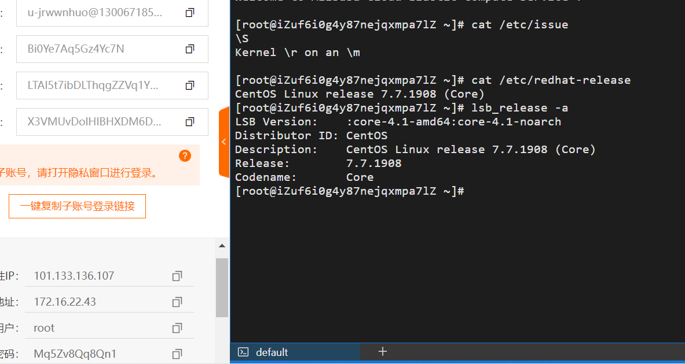
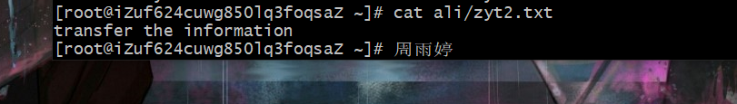

## 实验环境
1.虚拟机
2.git bash
3.阿里云上实验平台

## 实验过程 调查并记录实验环境的如下信息
### 当前linux当前 Linux 发行版基本信息及当前 Linux 内核版本信息
一.利用```lsb_release```及```cat /etc/issue```或```cat /etc/redhat-release```命令查看当前的发行版本信息<br/>
查询结果如下图：<br/>
ubuntu

aliyun
<br/>
二.使用```uname、cat /proc/version、dmesg | grep Linux```查询linux内核版本信息<br/>
查询结果如下图:<br/>
-r	显示内核发行版本号<br/>
-s	显示内核名称<br/>
-v	显示内核版本<br/>
ubuntu
<br/>
aliyun
<br/>
## Virtualbox 安装完 Ubuntu 之后新添加的网卡如何实现系统开机自动启用和自动获取 IP？
首先用ip a查看网卡有无未分配的ip地址，在20.04的版本中并不会出现这种情况<br/>
如图：
<br/>
然后可使用vim 查看```/etc/netplan/00-installer-config.yaml```这个文件
<br/>
可以看到网卡enp0s3下面有参数dhcp4: true，网卡enp0s8下面有参数dhcp4: true，说明二网卡已经开启了dhch地址分配，不需要再次配置。
但是在18.04版本中ip a查看，会发现未分配ip地址的网卡，此时需要前往```/etc/netplan/xx.installer```中按照标准修改，手动加入enp0s8，最后执行```sudo netplan apply```。<br/><br/>
## 如何使用 scp 在「虚拟机和宿主机之间」、「本机和远程 Linux 系统之间」传输文件？
### 虚拟机和宿主机
首先在宿主机中创建文件zyttest，并向其中写入信息
<br/>
在虚拟机中创建一个空的文件夹，里面没有文件，如图
<br/>
使用pwd查看当前文件的所在位置
<br/>
利用```scp local_file remote_username@remote_ip:remote_folder```命令格式，进行从宿主机到虚拟机的文件传输，可以发现在虚拟机的test文件中出现了zyttest.txt，打开它可以发现在宿主机中写入的信息this is my homework。<br/>
<br/>
在虚拟机的test文件中写入信息transfer again
<br/>
使用宿主机，利用```scp remote_username@remote_ip:remote_folder``` local file 将虚拟机的目的文件传输到宿主机<br/>
传输结果如下
<br/>
### 本机和远程linux系统
首先免密配置登陆远程linux系统
<br/>
再次在本机和远程linux系统中分别创建文件夹，可以观察到远程Linux文件夹为空
<br/>
向本机的文件夹中写入信息并打开查看
<br/>
同理利用```scp local_file remote_username@remote_ip:remote_folder```命令格式，把主机的文件传输给远程linux系统
<br/>
在远程linux系统下查看，可以发现已经收到该文件，并且可以打开查看
<br/>
向远程linux文件ali中写入last test
<br/>
最后利用```scp remote_username@remote_ip:remote_folder local file``` 将linux远程系统的目的文件传输到主机，发现存在last test
<br/>
## 如何配置 SSH 免密登录？
windows免密登录虚拟机ubuntu

首先用```ssh-keygen -t rsa```生成所需要的密钥<br/>
连续回车如图
<br/>

此时生成的密钥目录位置, 默认为当前用户home路径下的.ssh隐藏目录, 也就是~/.ssh/, 同时默认密钥文件名以id_rsa开头. 如果是root用户, 则在```/root/.ssh/id_rsa```, 若为其他用户, 则在```/home/username/.ssh/id_rsa```。<br/>
```id_rsa```: 生成的私钥文件<br/>
```id_rsa.pub```: 生成的公钥文件<br/>
然后通过 ```ssh-copy-id``` 命令设置```ssh-copy-id -i (.ssh/id_rsa.pub```文件位置) 用户名@xxx。最后一个参数是要免密钥登录的服务器 ip 地址。<br/>
<br/>
尝试免密登录<br/>
<br/>

## 实验过程中遇到的问题以及解决方案
第一题并未出现太大的问题<br/>
第二题在ip a查看网卡后发现并未有可以修改的网卡，比较懵，后发现20.04版本ubuntu会自动配置好ip a中出现的网卡，然后尝试创建18.04版本的虚拟机，可以发现网卡enp0s8并未分配好ip地址，之后进入网卡存放文件修改即可。<br/>
第三题主要是```scp local_file remote_username@remote_ip:remote_folder；scp remote_username@remote_ip:remote_folder local file```两条命令的应用，需要注意的是：不要省略，在本题中复习了mkdir创建文件夹，cd打开文件夹，学习了cat查看文件夹，echo向文件夹中写入信息的命令，起初在写入文件位置时会出现报错，发现是文件位置不完整，后使用pwd命令可以查看该文件的路径，按照该路径输入便不会出现问题；另外在本题中，利用git bash 免密登录了虚拟机和远程阿里云实验平台，使实验过程变得更加清晰，由于我是先完成了最后一题，所以在本题使用了两次ssh免密登录，也算是一种巩固吧。<br/>
最后一题ssh免密登陆我主要出现的问题就是在```ssh-copy-id -i``` (文件位置)用户名@xxx这一步，初次尝试没有输入用户名，导致后来输出端出现奇怪的结果如图<br/>
，<br/>后正常输入无报错，另外就是文件位置输入时出现文件不存在的报错，需要根据创建密钥时，命令行中出现的公钥地址(..../id_rsa.pub)即是，进行完整输入。其实最后一题本来做了很久，一直搞不清楚免密登录的概念是从哪里登录到哪里，最初陷入的错误就是在虚拟机的环境中，相当于在cuc@cuc-lab上配置密钥再登录到cuc@cuc-lab，今天听老师答疑的直播之后才豁然开朗，愉快完成了ssh免密登录的学习与配置。<br/>

### 参考链接：
(查看发行版本信息)<br/>
https://blog.csdn.net/qq_31278903/article/details/83146031
(查看内核版本信息)<br/>
https://cloud.tencent.com/developer/article/1878840
(在linux中创建文件并写入内容)<br/>
https://blog.csdn.net/m0_62301431/article/details/120939425
(scp命令教程)<br/>
https://www.runoob.com/linux/linux-comm-scp.html
(window配置ssh免密登录)<br/>
https://blog.csdn.net/qq_43901693/article/details/103700272
