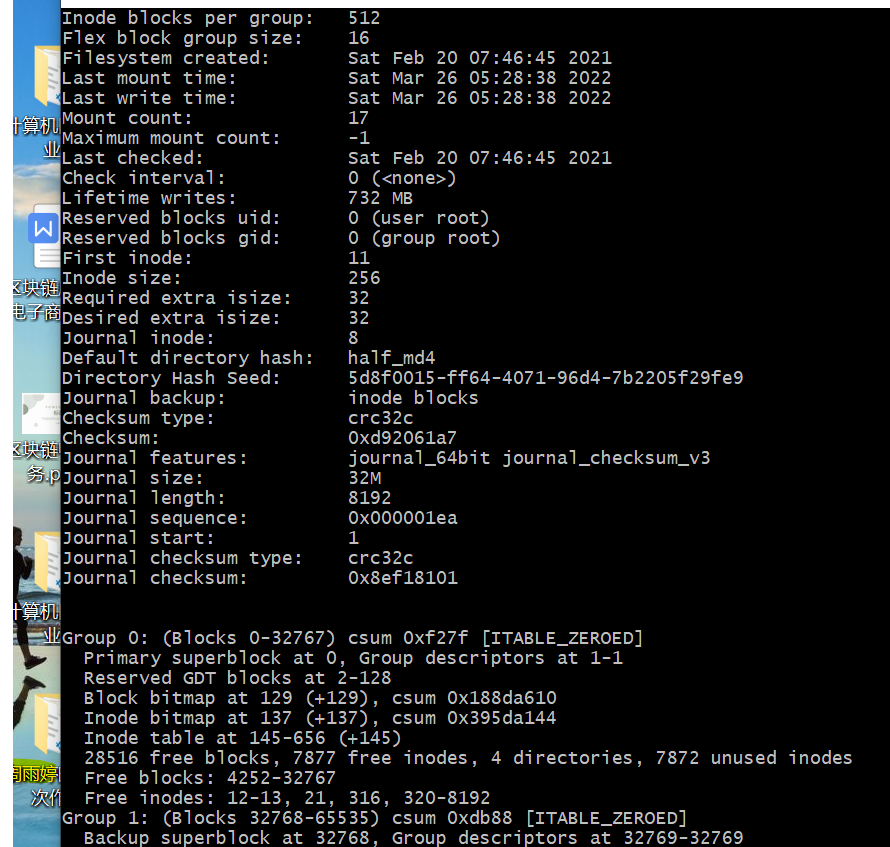
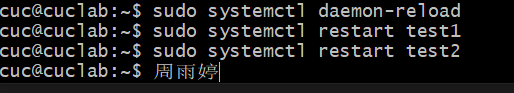
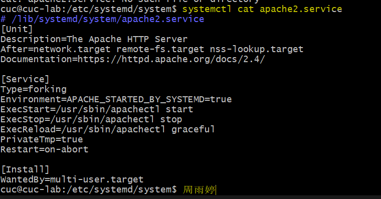

## 实验环境
ubuntu20.04<br/>
## 实验过程

### systemd跟练
#### (ubuntu20.04环境)<br/>
系统管理：<br/>
[](https://asciinema.org/a/PkTwB0DhU52LjK9xwWfYvudfs)<br/>
[](https://asciinema.org/a/OVi0AevJTKRYzPPOxQ9aPNe1X)<br/>
Unit:<br/>
[](https://asciinema.org/a/Nx5FEbn5G7CK1BLBVUw9Fg1Kl)<br/>
[](https://asciinema.org/a/xGldPdEwFPyB48U9gbPgr3e9g)<br/>
[](https://asciinema.org/a/wgpjXFSK6azEd9mKfUtjKkmFa)<br/>
[](https://asciinema.org/a/K4Wki589xQCyGTOzYioc1SxQm)<br/>
Target:<br/>
[](https://asciinema.org/a/yuZZP2JLHmCbkfhivXmiWMbiS)<br/>
日志管理:<br/>
[](https://asciinema.org/a/wC7IlJsk62731fcYaqbWXqaqj)<br/>
#### (centos环境)<br/>
系统管理：<br/>
1.重启系统：<br/>
<br/>
2.切断电源：<br/>
<br/>
3.[](https://asciinema.org/a/q9dg7wAOG4cRp00BmIRjqxwIm)<br/>
[](https://asciinema.org/a/m8hnfEX42lhpY0ziEpf23kz5q)<br/>
Unit:<br/>
[](https://asciinema.org/a/e8phcSCYlkT26u9pOttcYIMVU)<br/>
Target:<br/>
[](https://asciinema.org/a/WWu9jx5d5ZO7UYxG5DE3RyMvp)<br/>
日志管理:<br/>
[](https://asciinema.org/a/dhyJiuXj56PQ9X1psP5MK0QlK)<br/>
### 如何添加一个用户并使其具备sudo执行程序的权限？<br/>
1.添加用户<br/>
```sudo adduser username```<br/>
2.添加sudo权限<br/>
```sudo usermod -G sudo username```<br/>
<br/>
3.利用```cat /etc/passwd```可以查看用户是否存在<br/>
<br/>

### 如何将一个用户添加到一个用户组？<br/>
1.使用```cat /etc/group```查看所有用户组<br/>
<br/>
2.使用```usermod -G group_name user_name```将用户添加到指定用户组<br/>
比如将用户添加到sudo用户组，那么它就获得了sudo权限，使用```sudo usermod -G sudo username```<br/>

### 如何查看当前系统的分区表和文件系统详细信息？<br/>
1.使用```sudo fdisk -l```查看系统的分区情况<br/>
<br/>
<br/>
2.使用```df -T -h```命令查看挂载的文件系统类型<br/>
<br/>
然后使用```dumpe2fs [-h] 文件名```观察文件系统的详细信息<br/>
<br/>
<br/>
<br/>

### 如何实现开机自动挂载Virtualbox的共享目录分区？
1.以新创建的硬盘挂载为例，首先创建一块虚拟硬盘：<br/>
<br/>
<br/>
2.```lsblk```检查新增硬盘:<br/>
<br/>
3.对新增硬盘进行分区:<br/>
首先输入```sudo fdisk /dev/sdb``` 开始分区<br/>
<br/>
创建结果：<br/>
<br/>
<br/>
4.在指定分区创建文件系统:<br/>
```mkfs.ext4 /dev/sdb1```(1依次改为23)操作进行创建<br/>
<br/>
5.将分区挂载到目录:<br/>
首先创建挂载点，使用```mkdir -p /mnt/sdb1``` (1依次改为23)操作创建挂载点<br/>
然后用```mount /dev/sdb1 /mnt/sdb1``` 进行挂载<br/>
最后使用df -h进行查看<br/>
<br/>

### 基于LVM（逻辑分卷管理）的分区如何实现动态扩容和缩减容量？
1.首先取消刚挂载的sdb1<br/>
<br/>
2.三个分区创建成功<br/>
<br/>
3.创建VG<br/>
<br/>
4.创建LV<br/>
首先创建指定大小的lv卷，使用```lvcreate -L 10G -n {{demo-lv}} {{ubuntu-vg}}```语句<br/>
<br/>
将剩余空间创建完，使用```lvcreate -l {{100%FREE}} -n {{demo-lv}} {{ubuntu-vg}}```语句<br/>

5.创建文件系统并挂载<br/>
使用```mkdir -p {{path/to/target_directory}}``` <br/>
```mount -t {{filesystem_type}} {{path/to/device_file}} {{path/to/target_directory}}``` <br/>
挂载成功：<br/>
<br/>
6.使用```lvresize --size +{{120G}} --resizefs {{volume_group}}/{{logical_volume}}```进行扩容<br/>
<br/>
此处我再使用先进行了缩减步骤的lv再进行扩容<br/>
<br/>
<br/>
由上可见，本来只有2G的 zyt-lv-1，此时被扩容成为3G。
7.使用```lvresize --size -{{120G}} --resizefs {{volume_group}}/{{logical_volume}}```进行缩减<br/>
此处我缩减的是 zyt-lv-2，缩减了2G，所以```lvdisplay```查看zyt-lv-2可以发现原来大小为<7.99G,现在变为<5.99G。
<br/>
<br/>
### 如何通过systemd设置实现在网络连通时运行一个指定脚本，在网络断开时运行另一个脚本？
我的思路是创建两个实验脚本，将其中一个脚本的Unit区块下，After=网络连接，ExecStart=该脚本地址(启动进程时执行的命令),ExecStop字段是停止服务时执行的命令，所以使ExecStop=另一个脚本的地址，所以把修改配置文件以后，重新加载配置文件，然后重新启动相关服务。<br/>
重新加载配置文件:<br/>
```sudo systemctl daemon-reload``` <br/>
重启相关服务:<br/>
```sudo systemctl restart foobar``` <br/>
首先打开```/etc/systemd/system/```目录，在此目录下，新建.service文件，使用vim对其进行编辑。<br/>
<br/>
<br/>
<br/>
<br/>

### 如何通过systemd设置实现一个脚本在任何情况下被杀死之后会立即重新启动？实现杀不死？
我觉得是在Service区块中，修改killmode字段=none,即没有进程会被杀死，只是执行服务的stop命令，然后再修改restart字段改为always，不管什么情况都能实现杀不死。<br/>
我在虚拟机上下载apache2来做实验，查看apache2的service配置如图：<br/>
<br/>
然后对其进行编辑，修改killmode字段和restart字段:<br/>
<br/>
重新加载配置文件，然后重新启动相关服务。<br/>
<br/>

## 问题分析与解决办法
1.第一个问题是在进行lvm扩容时出现了``` Insufficient free space: 256 extents needed, but only 0 available```的报错，原因划定vg时已经固定了容量，lv容量从vg扩充，第一次已经将vg的空间全部划给lv，所以无法扩充。需扩充vg，但扩充vg需先扩pv，扩pv需新建分区。需要再创建一个物理分区，再将其扩充到pv新建分区。<br/>
2.实战部分的跟连指令大多在第一篇命令教程里都有，当我在运行某些指令例如```sudo systemctl enable httpd```这一句时，httpd实际上不是我的文件，是存在于作者电脑的文件，所以在进行这一系列操作时需要对我个人的文件来重启和结束，比较担心做这些操作之后我的文件配置会出问题，所以就没有执行该命令，只是在终端输入了一下，然后仔细阅读了实战的操作步骤。<br/>
3.倒数一二两道题我跟从自己的理解进行了解答，并且在编辑过程中大致学会了vim编辑的使用方法，也算是有所收获，在systemd的学习，一些简单的命令，例如查看一些资料之类的学的比较清楚，但是在设置时区及时间的时候会出现报错，可能是地点没有写对。更深层次的学习，还需要对一些文件的地址，概念认知更深一点才能更清楚解答。<br/>
## 参考资料
(添加一个用户并使其具备sudo执行程序的权限)[https://blog.csdn.net/breeze5428/article/details/52837768]<br/>
(创建、删除ubuntu账户，添加用户到组)[https://blog.csdn.net/beizhengren/article/details/80484682]<br/>
(Linux 查看磁盘分区、文件系统、磁盘的使用情况相关的命令和工具介绍)[https://www.cnblogs.com/hanson666/p/7102206.html]<br/>
(查看文件系统信息)[http://c.biancheng.net/view/889.html]<br/>
(Systemd 服务管理教程)[https://cloud.tencent.com/developer/article/1516125]<br/>
(网络连通时运行一个指定脚本，在网络断开时运行另一个脚本相关参考)[http://129.226.226.195/post/27384.html]