### 实验环境
ubuntu20.04
visual studio code 远程管理器
***
### 实验内容
#### 任务一：用bash编写一个图片批处理脚本，实现以下功能：
- [x] 支持命令行参数方式使用不同功能
- [x] 支持对指定目录下所有支持格式的图片文件进行批处理
支持以下常见图片批处理功能的单独使用或组合使用
  - [x] 支持对jpeg格式图片进行图片质量压缩
  - [x] 支持对jpeg/png/svg格式图片在保持原始宽高比的前提下压缩分辨率
  - [x] 支持对图片批量添加自定义文本水印
  - [x] 支持批量重命名（统一添加文件名前缀或后缀，不影响原始文件扩展名）
  - [x] 支持将png/svg图片统一转换为jpg格式图片

#### 任务二：用bash编写一个文本批处理脚本，对以下附件分别进行批量处理完成相应的数据统计任务：
#### [2014世界杯运动员数据](https://c4pr1c3.github.io/LinuxSysAdmin/exp/chap0x04/worldcupplayerinfo.tsv)
- [x] 统计不同年龄区间范围（20岁以下、[20-30]、30岁以上）的球员数量、百分比
- [x] 统计不同场上位置的球员数量、百分比
- [x] 名字最长的球员是谁？名字最短的球员是谁？
- [x] 年龄最大的球员是谁？年龄最小的球员是谁？

#### 任务二：用bash编写一个文本批处理脚本，对以下附件分别进行批量处理完成相应的数据统计任务：
#### [Web服务器访问日志](https://c4pr1c3.github.io/LinuxSysAdmin/exp/chap0x04/web_log.tsv.7z)
- [x] 统计访问来源主机TOP 100和分别对应出现的总次数
- [x] 统计访问来源主机TOP 100 IP和分别对应出现的总次数
- [x] 统计最频繁被访问的URL TOP 100
- [x] 统计不同响应状态码的出现次数和对应百分比
- [x] 分别统计不同4XX状态码对应的TOP 10 URL和对应出现的总次数
- [x] 给定URL输出TOP 100访问来源主机
***
### 实验过程
> 实验准备：下载安装shellcheck以及imagemagick<br/>
```sudo apt update```<br/>
```sudo apt install shellcheck```<br/>
```sudo apt install imagemagick```<br/>
下载文件到本地：<br/>
```wget "https://c4pr1c3.gitee.io/linuxsysadmin/exp/chap0x04/worldcupplayerinfo.tsv"```<br/>
将Web服务器访问日志下载到本地:<br/>
```wget "https://c4pr1c3.gitee.io/linuxsysadmin/exp/chap0x04/worldcupplayerinfo.tsv"```
<br/>

#### 任务一
> 因为是在vscode 远程连接环境下进行代码编写，我通过拖拽可以将主机中的某格式图片放入固定文件夹，如图：
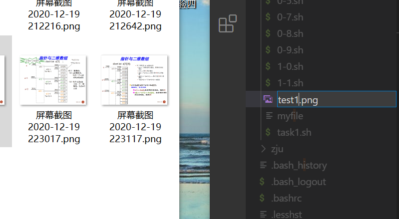


支持命令行参数方式使用不同功能<br/>
> 使用```while```语句并且用```case```达到使用不同功能的目的

支持对指定目录下所有支持格式的图片文件进行批处理<br/>

> 指定目录通过输入目录路径来实现，所支持的格式可以使用```*.png```、```*.jpg```等等,即```*```通配符来实现。

支持对jpeg格式图片进行图片质量压缩:<br/>
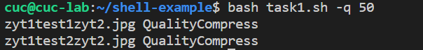<br/>
支持对jpeg/png/svg格式图片在保持原始宽高比的前提下压缩分辨率:<br/>
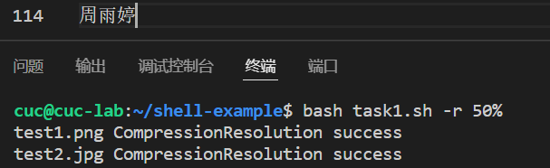<br/>
支持对图片批量添加自定义文本水印:<br/>
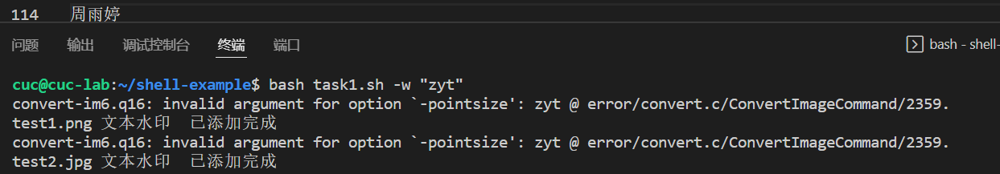<br/>
支持批量重命名（统一添加文件名前缀或后缀，不影响原始文件扩展名）:<br/>
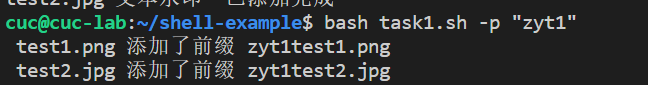
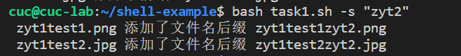<br/>
支持将png/svg图片统一转换为jpg格式图片:<br/>
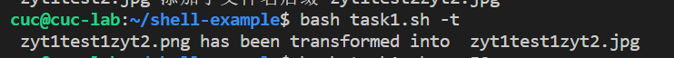<br/>
终端操作如下：

```
cuc@cuc-lab:~/shell-example$ bash task1.sh -r 50%
test1.png CompressionResolution success
test2.jpg CompressionResolution success

cuc@cuc-lab:~/shell-example$ bash task1.sh -w "zyt"
convert-im6.q16: invalid argument for option `-pointsize': zyt @ error/convert.c/ConvertImageCommand/2359.
test1.png 文本水印  已添加完成
convert-im6.q16: invalid argument for option `-pointsize': zyt @ error/convert.c/ConvertImageCommand/2359.
test2.jpg 文本水印  已添加完成

cuc@cuc-lab:~/shell-example$ bash task1.sh -p "zyt1"
test1.png 添加了前缀 zyt1test1.png 
test2.jpg 添加了前缀 zyt1test2.jpg 

cuc@cuc-lab:~/shell-example$ bash task1.sh -s "zyt2"
zyt1test1.png 添加了文件名后缀 zyt1test1zyt2.png 
zyt1test2.jpg 添加了文件名后缀 zyt1test2zyt2.jpg 

cuc@cuc-lab:~/shell-example$ bash task1.sh -t
zyt1test1zyt2.png has been transformed into  zyt1test1zyt2.jpg 

cuc@cuc-lab:~/shell-example$ bash task1.sh -q 50
zyt1test1zyt2.jpg QualityCompress
zyt1test2zyt2.jpg QualityCompress
```
#### 任务二
下载2014世界杯运动员数据文件：<br/>
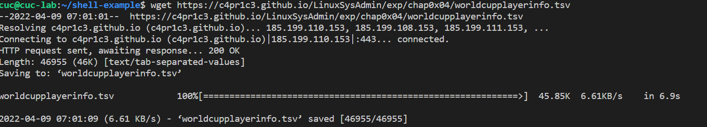<br/>

统计不同年龄区间范围（20岁以下、[20-30]、30岁以上）的球员数量、百分比:<br/>
```bash task2.sh -as```<br/>
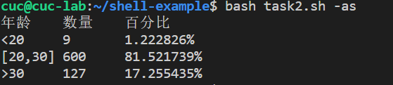<br/>
统计不同场上位置的球员数量、百分比:<br/>
```bash task2.sh -p```<br/>
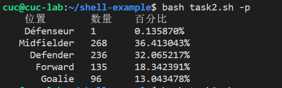
名字最长的球员是谁？名字最短的球员是谁:<br/>
```bash task2.sh -n```<br/>
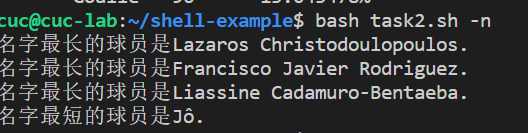<br/>

年龄最大的球员是谁？年龄最小的球员是谁:<br/>
```bash task2.sh -a```<br/>
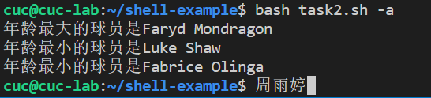<br/>
结果在[任务2-1结果](./task2-1result.md)文件
#### 任务三
下载解压web_log文件：<br/>
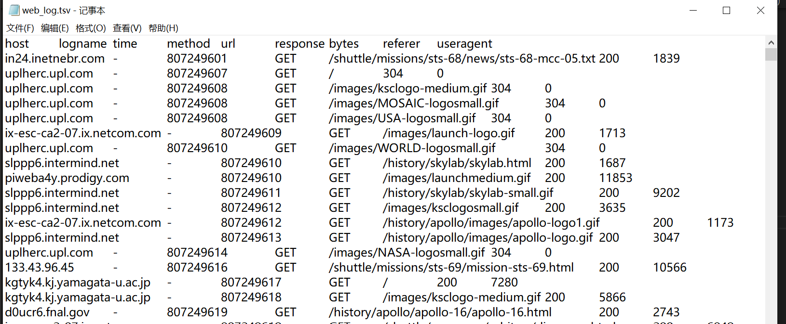<br/>
通过```web_log.tsv | sort -g -k 2 -r | head -100```可以列出经过筛选的列表的前一百。<br/>
使用```bash task3.sh -```参数来实现函数调用<br/>
统计访问来源主机TOP 100和分别对应出现的总次数<br/>
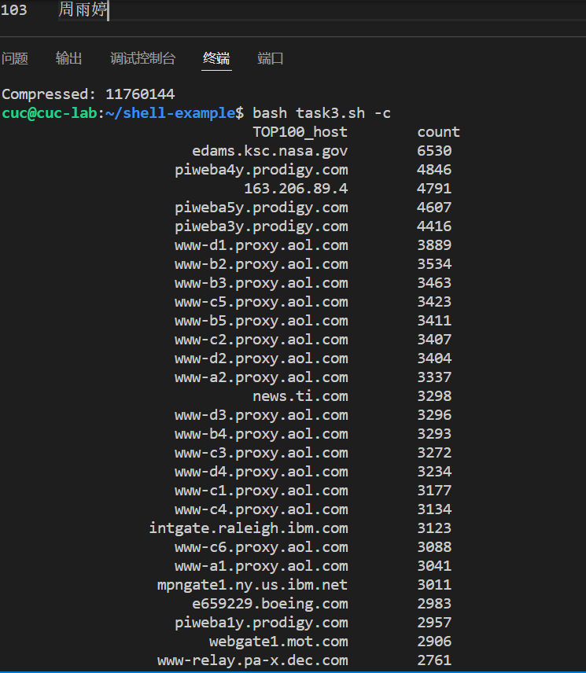<br/>
统计访问来源主机TOP 100 IP和分别对应出现的总次数<br/>
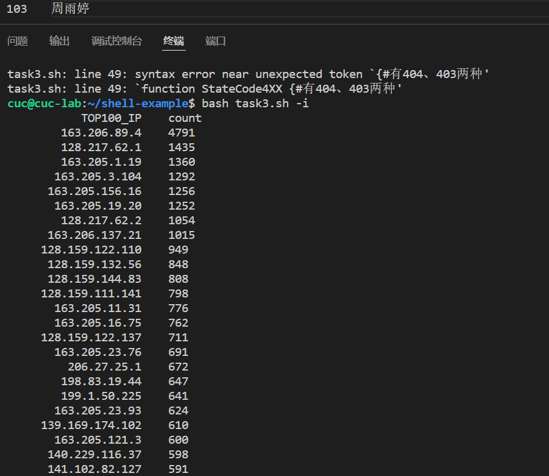<br/>
统计最频繁被访问的URL TOP 100<br/>
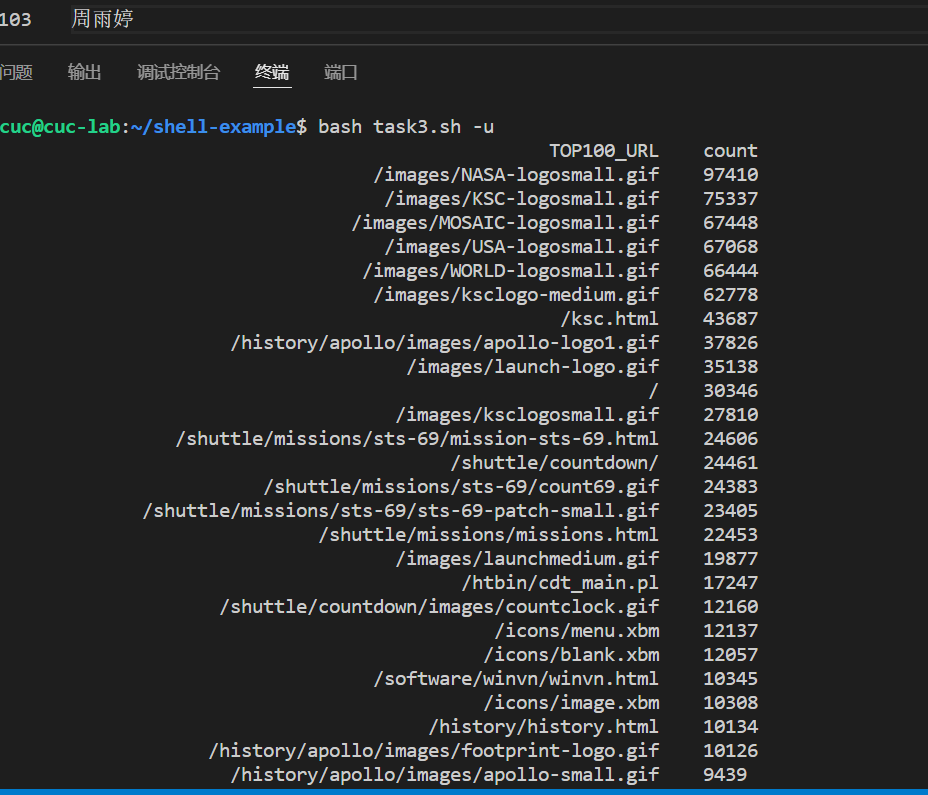<br/>
统计不同响应状态码的出现次数和对应百分比<br/>
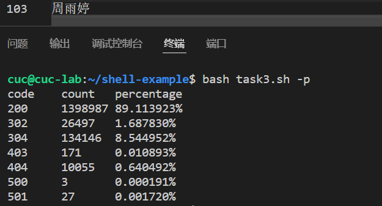<br/>
分别统计不同4XX状态码对应的TOP 10 URL和对应出现的总次数<br/>
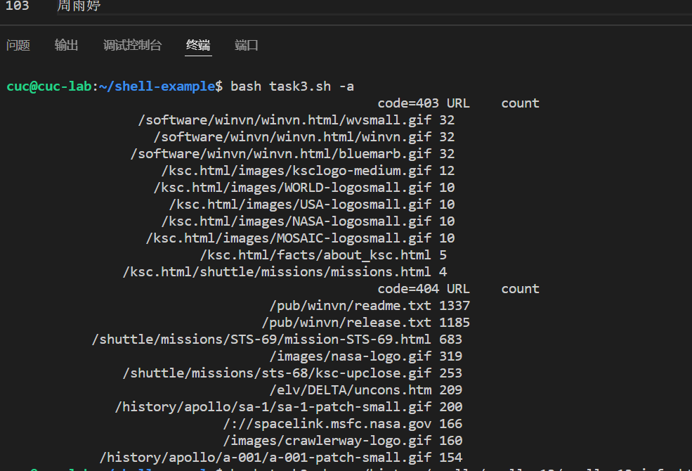<br/>
给定URL输出TOP 100访问来源主机<br/>
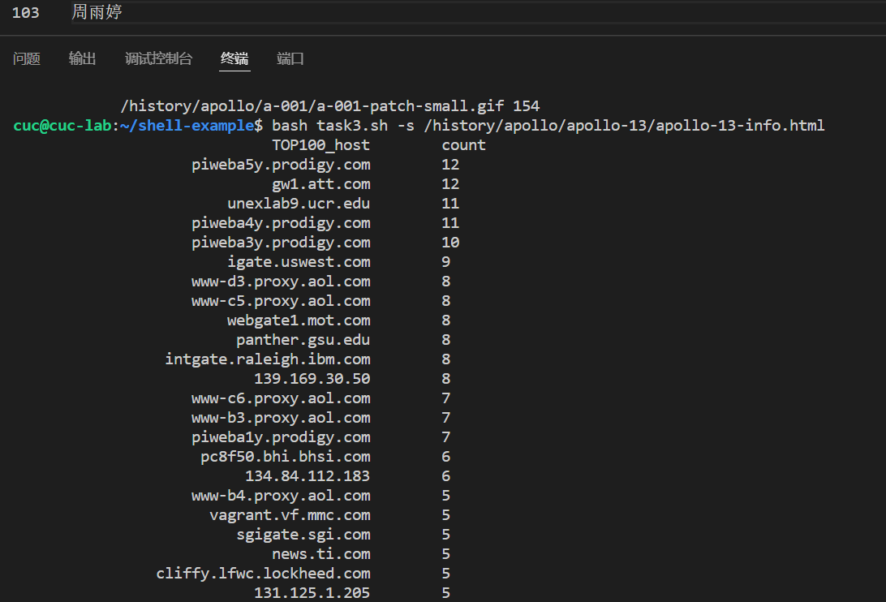<br/>

以上只截取了部分结果，具体结果在[任务2-2结果](./task2-2result.md)文件中。


***
### 问题与解决办法
1.首先在任务一中对jpg文件进行质量压缩时只考虑到了一种叫法，实际上jpg、JPEG、jpeg都是一样的文件格式，于是修改了一下。<br/>
2.不太清楚压缩图片等操作的命令，查找教程找到：<br/>
对jpeg格式图片进行图片质量压缩```convert file1 -quality 50 file2```<br/>
对jpeg/png/svg格式图片在保持原始宽高比的前提下压缩分辨率:```convert file1 -resize 50% file2```<br/>
对图片批量添加自定义文本水印:```convert file1 -pointsize 50 -fill pink -gravity center -draw "text 5,5 'zyt' " file2```<br/>
批量重命名（统一添加文件名前缀或后缀，不影响原始文件扩展名）:```mv file1 file2```<br/>
将png/svg图片统一转换为jpg格式图片:```convert xxx.png(xxx.svg) xxx.jpg```<br/>
3.熟悉awk的用法，例如：(输出第二列和第六列的内容)<br/>
```awk '{printf $2 "\t" $6 "\n"}' student.txt```<br/>
```Name Average```<br/>
```Liming 87.66```<br/>
```Sc 85.66```<br/>
```Gao 91.66```<br/>
$2与6分别代表第二个字段和第六个字段，所以这条 awk 命令会列出 student.txt 文件的第二个字段和第六个字段。<br/>
```BEGIN``` 是 awk 的保留字，是一种特殊的条件类型。BEGIN 的执行时机是"在 awk 程序一开始，尚未读取任何数据之前"。<br/>
```END``` 也是 awk 的保留字，不过刚好和 BEGIN 相反。END 是在 awk 程序处理完所有数据，即将结束时执行的。END 后的动作只在程序结束时执行一次。<br/>
```awk -F  #-F```相当于内置变量FS, 指定分割字符<br/>
4.在进行任务2、3时，需要下载指定文件，采用wget命令进行下载：```wget https://c4pr1c3.github.io/LinuxSysAdmin/exp/chap0x04/worldcupplayerinfo.tsv```<br/>
在下载任务三文件时，由于其格式是.7z所以需要对其解压之后再
```wget https://c4pr1c3.github.io/LinuxSysAdmin/exp/chap0x04/web_log.tsv.7z```<br/>
5.对task2.sh进行错误检查时有如下报错：
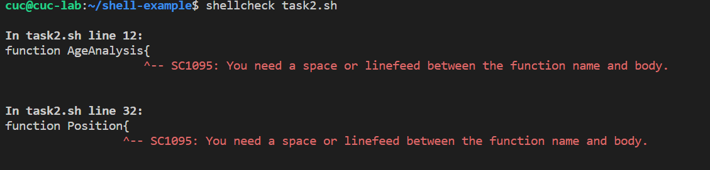<br/>
根据报错修改，在函数名以及大括号{之间增加空格间隙，问题解决。

6.不了解筛选前n行的命令，搜索得：```web_log.tsv | sort -g -k 2 -r | head -n```
***
### 参考文献
[Shell菜鸟教程](https://markdown.com.cn/basic-syntax/links.html)
[Shell特殊变量](http://c.biancheng.net/cpp/view/2739.html)
[Shell各种符号意义详解](https://blog.csdn.net/daocaokafei/article/details/120050007)
[Shell符号及各种解释对照表](https://blog.csdn.net/thy822/article/details/71775603)
[shellread命令](http://c.biancheng.net/view/2991.html)
[imagemagick命令](https://www.cnblogs.com/ITtangtang/p/3951240.html)
[imagemagick命令2](https://www.jianshu.com/p/6a0f1168663b)
[imagemagick命令3](https://www.thisfaner.com/p/imagemagick/)
[ImageMagick convert命令](https://blog.csdn.net/weixin_36024609/article/details/79861499)
[ImageMagick convert命令2](https://www.jianshu.com/p/68196b215289)
[Shellawk命令详解](http://c.biancheng.net/view/992.html)
[2021-linux-SagiSiuirs](https://github.com/CUCCS/2021-linux-public-SagiSiuirs/)