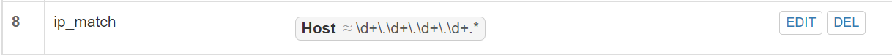

### 实验环境
***
ubuntu20.04<br/>
vscode远程连接虚拟机<br/>
nginx<br/>
verynginx<br/>
wordpress<br/>
dvwa<br/>

### 实验要求
***
1.基本要求 在一台主机（虚拟机）上同时配置Nginx和VeryNginx
* VeryNginx作为本次实验的Web App的反向代理服务器和WAF
* PHP-FPM进程的反向代理配置在nginx服务器上，VeryNginx服务器不直接配置Web站点服务
* 使用Wordpress搭建的站点对外提供访问的地址为： http://wp.sec.cuc.edu.cn
* 使用Damn Vulnerable Web Application (DVWA)搭建的站点对外提供访问的地址为： http://dvwa.sec.cuc.edu.cn

2.安全加固要求
* 使用IP地址方式均无法访问上述任意站点，并向访客展示自定义的友好错误提示信息页面-1
* Damn Vulnerable Web Application (DVWA)只允许白名单上的访客来源IP，其他来源的IP访问均向访客展示自定义的友好错误提示信息页面-2
* 在不升级Wordpress版本的情况下，通过定制VeryNginx的访问控制策略规则，热修复WordPress < 4.7.1 - Username Enumeration
* 通过配置VeryNginx的Filter规则实现对Damn Vulnerable Web Application (DVWA)的SQL注入实验在低安全等级条件下进行防护

3.VeryNginx配置要求
* VeryNginx的Web管理页面仅允许白名单上的访客来源IP，其他来源的IP访问均向访客展示自定义的友好错误提示信息页面-3
* 通过定制VeryNginx的访问控制策略规则实现：
    * 限制DVWA站点的单IP访问速率为每秒请求数 < 50
    * 限制Wordpress站点的单IP访问速率为每秒请求数 < 20
    * 超过访问频率限制的请求直接返回自定义错误提示信息页面-4
    * 禁止curl访问
### 实验过程
#### 修改windows的hosts文件
***
首先windows+x键打开，找到管理员点击，在出现的窗口中输入notepad，然后打开文件，在drivers文件夹里显示所有文件找到hosts，点击进入开始修改。<br/>
<br/>
<br/>
```
# web
192.168.56.101 vn.sec.cuc.edu.cn
192.168.56.101 dvwa.sec.cuc.edu.cn
192.168.56.101 wp.sec.cuc.edu.cn
```
#### 安装配置nginx
***

* 首先安装php相关文件
```
sudo apt install php-fpm php-mysql php-curl php-gd php-intl php-mbstring php-soap php-xml php-xmlrpc php-zip
```
* 下载nginx
```
sudo apt update
sudo apt install nginx
```
* 配置nginx
``` 
sudo vim /etc/nginx/sites-enabled/default
```
修改以下为：<br/>
```
root /var/www/html/wp.sec.cuc.edu.cn;

        # Add index.php to the list if you are using PHP
        index readme.html index.php;

        server_name _;

        location / {
                # First attempt to serve request as file, then
                # as directory, then fall back to displaying a 404.
                try_files $uri $uri/ =404;
        }

        # pass PHP scripts to FastCGI server
        #
        location ~ \.php$ {
        #       include snippets/fastcgi-php.conf;
        #
        #       # With php-fpm (or other unix sockets):
                fastcgi_pass unix:/var/run/php/php7.4-fpm.sock;
                fastcgi_index index.php;
                fastcgi_param SCRIPT_FILENAME $document_root$fastcgi_script_name;
                include fastcgi_params;
        #       # With php-cgi (or other tcp sockets):
        #       fastcgi_pass 127.0.0.1:9000;
        }
```
#### 安装配置veryngnix
***
* 首先在安装之前，下载以下库
```
# zlib
sudo apt-get install zlib1g-dev
# pcre
sudo apt-get update 
sudo apt-get install libpcre3 libpcre3-dev
# gcc 
sudo apt install gcc
# make
sudo apt install make
# penssl library
sudo apt install libssl-
```
* 然后从verynginx库克隆至本地，然后打开VeryNginx目录，查看是否安装python3，用python3下载文件。<br/>
```
git clone https://github.com/alexazhou/VeryNginx.git
cd VeryNginx
sudo python3 install.py install
```
* 配置
修改用户为www-data、修改监听端口为8081<br/>
```
user  www-data;
worker_processes  auto;

#error_log  logs/error.log;
#error_log  logs/error.log  notice;
#error_log  logs/error.log  info;

#pid        logs/nginx.pid;


events {
    worker_connections  1024;
}

include /opt/verynginx/verynginx/nginx_conf/in_external.conf;

http {
    include       mime.types;
    default_type  application/octet-stream;

    #log_format  main  '$remote_addr - $remote_user [$time_local] "$request" '
    #                  '$status $body_bytes_sent "$http_referer" '
    #                  '"$http_user_agent" "$http_x_forwarded_for"';

    #access_log  logs/access.log  main;
    sendfile        on;
    #tcp_nopush     on;

    #keepalive_timeout  0;
    keepalive_timeout  65;
        client_body_buffer_size 128k;

    #gzip  on;

        #this line shoud be include in every http block
    include /opt/verynginx/verynginx/nginx_conf/in_http_block.conf;

    server {
        listen       192.168.56.101:8081;
        
        #this line shoud be include in every server block
        include /opt/verynginx/verynginx/nginx_conf/in_server_block.conf;

        location = / {
            root   html;
            index  index.html index.htm;
            
        }
    }
```
* 给相关权限
```
sudo chmod -R 777 /opt/verynginx/verynginx/configs
```
* 启动verynginx

```
sudo /opt/verynginx/openresty/nginx/sbin/nginx
```
启动进程。然后在主机网页ip:+端口号+/verynginx/index.html<br/>
进入如下界面，账号名和密码为：verynginx/verynginx.<br/>
<br/>
<br/>

#### 安装配置wordpress
***
* 首先下载7z解压缩软件
```
sudo apt install p7zip-full
```
* 下载安装包并解压
```
sudo wget https://wordpress.org/wordpress-4.7.zip
7z x wordpress-4.7.zip
```
* 把wordpress移动到指定路径
```
sudo mkdir /var/www/html/wp.sec.cuc.edu.cn
sudo cp wordpress /var/www/html/wp.sec.cuc.edu.cn
```
* 安装mysql并创建用户
```
sudo apt install mysql-server
sudo mysql
CREATE DATABASE wordpress DEFAULT CHARACTER SET utf8 COLLATE utf8_unicode_ci;
create user 'zyt'@'localhost' identified by '123456';
grant all on wordpress.* to 'zyt'@'localhost';
```


* 打开wordpress登陆
在网页输入
```
http://wp.sec.cuc.edu.cn/wordpress/wp-admin/setup-config.php
```
就能进入如下下界面：

* 配置一下文件
```
sudo vim wp-config-sample.php
改名：mv wp-config-sample.php wp-config.php
```
```
// ** MySQL settings - You can get this info from your web host ** //
/** The name of the database for WordPress */
define( 'DB_NAME', 'wordpress' );

/** MySQL database username */
define( 'DB_USER', 'zyt' );

/** MySQL database password */
define( 'DB_PASSWORD', '123456' );

/** MySQL hostname */
define( 'DB_HOST', 'localhost' );

/** Database charset to use in creating database tables. */
define( 'DB_CHARSET', 'utf8' );

/** The database collate type. Don't change this if in doubt. */
define( 'DB_COLLATE', '' );
```

<br/>
<br/>
<br/>

#### DVWA安装与配置
***
* 下载DVWA
```
# 下载
git clone https://github.com/digininja/DVWA.git
# 建立目录
sudo mkdir /var/www/html/dvwa.sec.cuc.edu.cn
# 移动文件夹内容至该目录下
sudo mv DVWA/* /var/www/html/dvwa.sec.cuc.edu.cn
```
* 为DVWA建立数据库
```
mysql> create database dvwa;
Query OK, 1 row affected (0.00 sec)

mysql> create user dvwa@localhost identified by 'p@ssw0rd';
Query OK, 0 rows affected (0.01 sec)

mysql> grant all on dvwa.* to dvwa@localhost;
Query OK, 0 rows affected (0.01 sec)

mysql> flush privileges;
Query OK, 0 rows affected (0.00 sec)

mysql> exit;
```
* 配置php
```
# 进入/var/www/html/dvwa.sec.cuc.edu.cn/config/目录下的config.inc.php.dist文件
# 改名为config.inc.php
sudo mv config.inc.php.dist config.inc.php
```
打开config.inc.php文件发现默认配置是正确的<br/>

接着修改php-fpm的文件<br/>
```
sudo vim /etc/php/7.4/fpm/php.ini 
# 修改内容
allow_url_include = on
allow_url_fopen = on
safe_mode = off
display_errors = off
#重启php
systemctl restart php7.4-fpm.service
#将所有权分配给www-data用户和组
sudo chown -R www-data.www-data /var/www/html/dvwa.sec.cuc.edu.cn
```
* 配置服务器
```
sudo vim /etc/nginx/sites-available/dvwa.sec.cuc.edu.cn

# 写入
server {
    listen 8080 default_server;
    listen [::]:8080 default_server;
	
    root /var/www/html/dvwa.sec.cuc.edu.cn;
    index index.php index.html index.htm index.nginx-debian.html;
    server_name dvwa.sec.cuc.edu.cn;

    location / {
        #try_files $uri $uri/ =404;
        try_files $uri $uri/ /index.php$is_args$args;  
    }

    location ~ \.php$ {
        include snippets/fastcgi-php.conf;
        fastcgi_pass unix:/var/run/php/php7.4-fpm.sock;
    }

    location ~ /\.ht {
        deny all;
    }
}

# 符号链接

sudo ln -s /etc/nginx/sites-available/dvwa.sec.cuc.edu.cn /etc/nginx/sites-enabled/

# 测试并重启Nginx服务

sudo nginx -t
systemctl restart nginx.service
```
* 登陆

```
在网页输入dvwa.sec.cuc.edu.cn:8080
```
可进入如下页面：<br/>
<br/>
<br/>
<br/>

#### 配置PHP-FPM进程的反向代理
***
* 创建文件并写入数据
```
sudo vim /etc/nginx/sites-available/wp.sec.cuc.edu.cn
```
```
server {
	listen 8001 default_server;

    # 设置网页的根目录等相关内容
    root /var/www/html/wp.sec.cuc.edu.cn;
    index index.php index.html index.htm index.nginx-debian.html;
    server_name wp.sec.cuc.edu.cn;

    location / {
        # try_files $uri $uri/ =404;
        try_files $uri $uri/ /index.php$is_args$args;

    }
    # 配置反向代理
    location ~ \.php$ {
      include snippets/fastcgi-php.conf;
      fastcgi_pass unix:/var/run/php/php7.4-fpm.sock;
    }

    location ~ /\.ht {
        deny all;
    }
}
```
* 创建从新服务器块配置文件到/etc/nginx/sites-enabled/目录的符号链接
```
sudo ln -s /etc/nginx/sites-available/wp.sec.cuc.edu.cn /etc/nginx/sites-enabled/
```
* 取消链接默认配置文件
```
sudo unlink /etc/nginx/sites-enabled/default
```
* 重启nginx
```
sudo nginx -t
sudo systemctl reload nginx
```

#### 安全加固要求
***
* 使用IP地址方式均无法访问上述任意站点，并向访客展示自定义的友好错误提示信息页面-1
<br/>
<br/>
<br/>
<br/>
* Damn Vulnerable Web Application (DVWA)只允许白名单上的访客来源IP，其他来源的IP访问均向访客展示自定义的友好错误提示信息页面-2
<br/>
<br/>
<br/>

* 在不升级Wordpress版本的情况下，通过定制VeryNginx的访问控制策略规则，热修复WordPress < 4.7.1 - Username Enumeration
<br/>
<br/>
* 通过配置VeryNginx的Filter规则实现对Damn Vulnerable Web Application (DVWA)的SQL注入实验在低安全等级条件下进行防护
首先设置低安全等级
<br/>
<br/>
<br/>
<br/>
<br/>

#### VeryNginx配置要求
***
* VeryNginx的Web管理页面仅允许白名单上的访客来源IP，其他来源的IP访问均向访客展示自定义的友好错误提示信息页面-3
<br/>
<br/>
<br/>
* 通过定制VeryNginx的访问控制策略规则实现：
    * 限制DVWA站点的单IP访问速率为每秒请求数 < 50
    <br/>
    * 限制Wordpress站点的单IP访问速率为每秒请求数 < 20
    <br/>
    * 超过访问频率限制的请求直接返回自定义错误提示信息页面-4
    <br/>
    * 禁止curl访问
    <br/>
    <br/>
    cmd端<br/>
    ```
    curl http://dvwa.sec.cuc.edu.cn:8081
    ```
    <br/>
    拦截成功。

### 实验问题与解决办法
***
1.使用<br/>
```
sudo /opt/verynginx/openresty/nginx/sbin/nginx
```
语句启动verynginx是否能正常运行<br/>
根据报错结果：<br/>
```nginx: [emerg] bind() to 192.168.56.101:80 failed (98: Address already in use)
nginx: [emerg] bind() to 192.168.56.101:80 failed (98: Address already in use)
nginx: [emerg] bind() to 192.168.56.101:80 failed (98: Address already in use)
nginx: [emerg] bind() to 192.168.56.101:80 failed (98: Address already in use)
nginx: [emerg] bind() to 192.168.56.101:80 failed (98: Address already in use)
nginx: [emerg] still could not bind()
```
verynginx端口被占用,应该是之前下载的apache2占用了该端口，选择卸载apache2。<br/>

2.在登陆wordpress时，遇到了run install这一步之后回到最初的起点问题，后经过同学的帮助在终端运行了<br/>
```
sudo chown -R www-data:www-data /var/www/html
```
成功进入下一个界面<br/>
<br/>

3.碰到问题试试<br/>
```
sudo nginx -t
sudo systemctl reload nginx
```
### 参考文献
[wordpress](zhuanlan.zhihu.com/p/445191504)<br/>
[DVWA](https://github.com/digininja/DVWA/blob/master/README.zh.md)<br/>
[php-fpm反向代理](https://www.cnblogs.com/wanglijun/p/10867426.html)<br/>
[2021-linux-public-kal1x](https://github.com/CUCCS/2021-linux-public-kal1x/blob/chap0x05/chap0x05/%E7%AC%AC%E4%BA%94%E6%AC%A1%E5%AE%9E%E9%AA%8C.md)<br/>